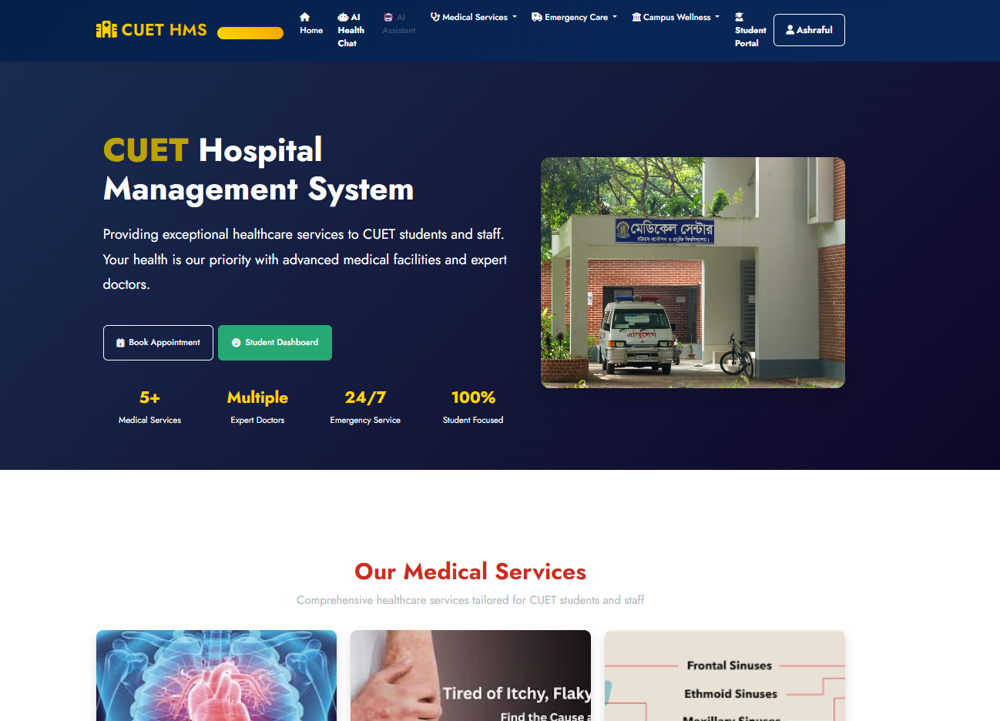
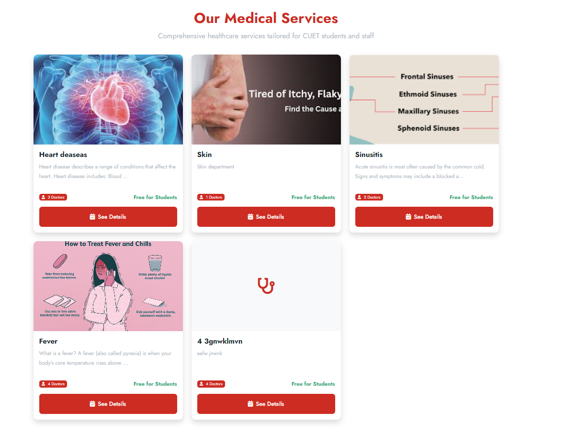

# 🏥 CUET Hospital Management System

A web-based hospital management system designed for CUET Medical Center.

---

## 🚀 Features

- Patient Registration
- Doctor Appointment System
- Admin Dashboard
- Medical Record Management
- E-Booklet management
- Role Based Access Control

---

## 📸 Screenshots

### Front Page

### Dashboard

---

## 📄 Documentation

📥 [Download Full Project Report](Project_Report.pdf)

---

## 🛠️ Technologies Used

- HTML, CSS, JavaScript
- Django fro backend
- DBSqlite
- Bootstrap
- Google gemini API

---

## 👨‍💻 Developed By

Ashraful Islam  
CUET – CSE Department
